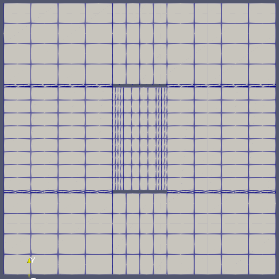

# MFEM Oxford Nano Systems
A simple electromagnetics case expanded from MFEM
tutorial ex5p solving the Darcy problem using the
same finite element spaces etc.. but different physical
interpertations. The system solves these equations in using mixed H(div),
H1 spaces.
```math
\displaylines{k \vec{J} + \nabla v = \vec{J_e}, \\
- \nabla \cdot \vec{J} = Q,}
```

This application is dependant on MFEM, METIS/PARMETIS, HYPRE, MPI (OpenMPI was used) and a 
C-compiler (GCC was used) however these are straight forward to install. The process of 
installing/getting this library is as follows:

1) install MFEM using your [preferred installation method](https://mfem.org/building/)

2) Clone this repository alongside MFEM
  `git clone https://github.com/SohailSTFC/MFEM_OxfordNanoSystems.git`

3) Build the application with the following command,
  `cd MFEM_OxfordNanoSystems && make`

4) Run the application

# Sample problem 0:
A sample 2-D problem without any kind of shield around the plate to regularise the local field.
The electrodes are set to 3.0v and the plate is set to 0.0v, the outer boundary has a no-flux
boundary conditions ($\vec{n} \cdot \vec{J} = 0  $). The initial mesh fo this problem can be
seen bellow:



This problem is run using the following commmand options:
