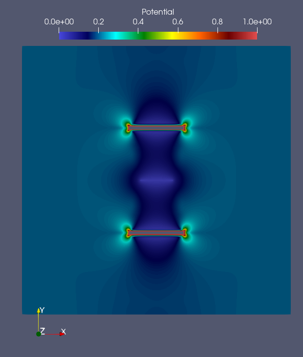
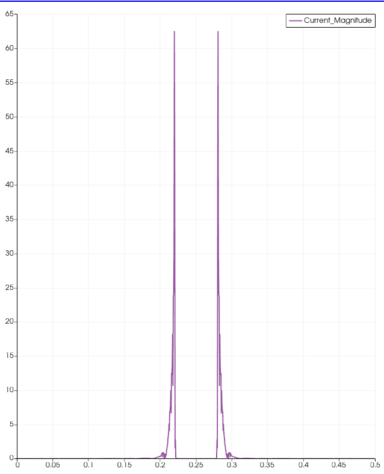

# MFEM Oxford Nano Systems
A simple electromagnetics case expanded from MFEM
tutorial ex5p and  ex0p using the similar finite element spaces
etc.. but different physical interpretations. 

 The EMsampleProbV solves the following equations in using mixed H1 spaces.
```math
\displaylines{ \nable \cdot \nabla v = \vec{J_e} \\
```

 The EMsampleProbJV solves the following equations in using mixed H(div)-H1 spaces.
```math
\displaylines{k \vec{J} + \nabla v = \vec{J_e}, \\
- \nabla \cdot \vec{J} = Q,}
```

This application is dependant on MFEM, METIS/PARMETIS, HYPRE, MPI (OpenMPI was used) and a 
C-compiler (GCC was used) however these are straight forward to install. The process of 
installing/getting this library is as follows:

1) Install MFEM using your [preferred installation method](https://mfem.org/building/)

2) Clone this repository alongside MFEM
  `git clone https://github.com/SohailSTFC/MFEM_OxfordNanoSystems.git`

3) Build the application with the following command,
  `cd MFEM_OxfordNanoSystems && make`

4) Run the application

# Sample problem 0:
A sample 2-D problem without any kind of shield around the plate to regularise the local field.
The electrodes are set to 3.0v and the plate is set to 0.0v, the outer boundary has a no-flux
boundary conditions ($\vec{n} \cdot \vec{J} = 0  $). This problem is the default problem and 
will automatically run if no other command line options are specified.
The initial mesh for this problem can be seen bellow:


This problem is run using the following commmand options if built with MPI 
(the number of processes can be increased to reflect the number of available 
cores however by default its set to 1):

`mpirun -np 1 ./EMsampleProb`.

or

`mpirun -np 1 ./EMsampleProb --mesh mesh/OxNanoSys0.mesh`

Figures of a sample potential field (top) and a probe of thecurrent magnitude across the plate (bottom) is given by :
  |  

By restricting the J-magnitude to 20 amps, it can be seen there are concentrations of currents at the corners
of the plate/workpiece.


# Sample problem 1:
This uses MFEM features for external meshes based off of the [MFEM tutorial](https://mfem.org/tutorial/meshvis/) , it has the additional dependency
of using gmsh however this can be [cloned from gitlab](https://gitlab.onelab.info/gmsh/gmsh) and built for your system or downloaded as a [windows ready binary](https://gmsh.info/).
Gmsh can read in most mesh formats and output them into the Gmsh format which is readable from MFEM, however in this sample problem the Native geometry format is used and a mesh is generated from that. The geometry file for Gmsh is ("OxNanoSys1.geo") it is an extruded version of sample problem 0 and can be meshed in Gmsh to produce ("OxNanoSys1.msh"). The top and bottom boundaries are assumed to be free boundaries while the rest inherit form the 2D case. To run sample case use the following command:

`mpirun -np 1 ./EMsampleProb --mesh mesh/OxNanoSys1.msh`

